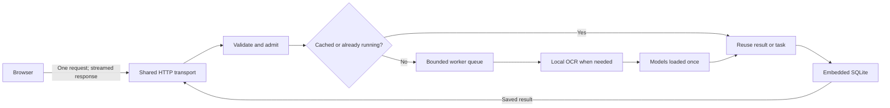

# AwareLink — local ML edition

A recreation of the original AwareLink project for a local computer or one server. URL, news-text and screenshot checks use trained local models. The browser sends one analysis request and receives progress and the saved result through the same response.

**No LLM service, API key, remote database, Redis, frontend framework or CDN is required.** Three direct Python dependencies provide HTTP serving, safe reusable outbound connections and image validation. Model inference uses the Python standard library. Screenshot text recognition additionally needs the local Tesseract executable.

This is an academic research baseline. URL scores describe historical domain patterns, screenshots are assessed through their extracted text, and news always requires source verification. The news artifact has research-only dataset terms. See the [model card](docs/MODEL_CARD.md) before changing the deployment scope.

## Run on Windows

Use Python 3.11 or newer; this build was tested on Python 3.13.5. Open a terminal in this directory, then:

```powershell
.\setup.ps1
.\start.ps1
```

If your PowerShell policy prevents local scripts, use the explicit local-script invocation:

```powershell
powershell -ExecutionPolicy Bypass -File .\setup.ps1
powershell -ExecutionPolicy Bypass -File .\start.ps1
```

Open **http://127.0.0.1:8765**. `setup.ps1` creates an isolated `.venv` and installs only the pinned runtime packages. `start.ps1` uses it and keeps the server in the current terminal; Ctrl+C stops it. Python and pip must be available before running setup. No training downloads occur at startup.

Equivalent commands, also usable on Linux/macOS:

```text
python -m venv .venv
# Windows:
.venv\Scripts\python -m pip install -r requirements.txt
.venv\Scripts\python -m awarelink
# Linux/macOS:
.venv/bin/python -m pip install -r requirements.txt
.venv/bin/python -m awarelink
```

## Screenshots and administrator access

For screenshots, install [Tesseract](https://tesseract-ocr.github.io/tessdoc/Installation.html) with English language data. The application discovers it on PATH or at the usual Windows installation location. To use another location:

```powershell
$env:TESSERACT_CMD='C:\Program Files\Tesseract-OCR\tesseract.exe'
.\start.ps1
```

URL and news checks work without OCR. Supported images are single-frame PNG, JPEG, WebP and BMP, up to 2,000,000 bytes and 12 megapixels. OCR runs locally with a 12-second limit; temporary images are removed afterward. A small subprocess starts for each uncached screenshot, so OCR has higher latency than text classification.

Administrator access starts disabled. Stop the server and configure a password of at least 12 characters:

```powershell
.venv\Scripts\python -m awarelink --setup-admin
.\start.ps1
```

The command prompts privately and stores a salted password hash in `data/admin.json`. There is no default password. The administrator view includes all three analysis kinds, feedback, model information, counts and deletion. Restart after changing administrator configuration.

## What is included

- URL classification, with an optional bounded live website inspection.
- English screenshot OCR, message-spam classification and extracted-URL checks.
- News-language triage with mandatory review and model limitations.
- Streamed progress, cancellation, personal recent history, share links and feedback.
- A domain-only community view and manually refreshed headlines from one feed.
- Protected administrator overview, filters and deletion with related feedback cleanup.
- Training scripts, exported JSON models, independent tests, architecture notes and reproducible benchmarks.

The initial `/api/bootstrap` response supplies the session's CSRF token, capabilities, history and community results together. Each check then uses **one** `POST /api/analyze`; there is no status polling. Sharing, feedback, administrator actions and explicitly loading headlines are separate user actions.

## Processing and measured performance



The pipeline holds four running jobs and eight waiting jobs by default. Identical pending inputs share computation; a bounded ten-minute cache avoids repeated inference. Models and outbound pools stay loaded. SQLite uses WAL and persistent local connections. HTTP/1.1 streams finish explicitly so the browser can reuse its connection. An initial connection and any optional external website connection still have ordinary network setup costs.

On the development computer, real local HTTP benchmarks reused **one socket across 221 requests**. Complete short-input analysis plus saving measured p95 **4.20–7.37 ms for URLs** and **3.21–6.87 ms for news** across two documented runs. These are sequential localhost measurements, excluding OCR, remote network, TLS and browser rendering; they are not capacity guarantees. See [methodology and results](docs/PERFORMANCE.md).

## Data and configuration

The default `data/` directory holds the SQLite database, persistent session-signing secret and optional administrator password hash. It is excluded from version control. Screenshots are not retained; extracted text and original submitted text are retained locally with their analysis. Anyone with file access to this directory can read that data.

Personal history is attached to the browser's anonymous cookie (30-day session). Clearing or losing that cookie creates a new history identity. There are no end-user accounts or synchronization across browsers. Administrator sessions expire after six hours. Logging out rotates and revokes the session.

Share links grant access to a result to anyone holding the link. Shared screenshot results omit the extracted-text field but can still show detected URL and text-feature signals; URL results expose the submitted URL. Avoid sharing sensitive material. Community results disclose only high-risk URL domains, scores and dates. Feedback is retained for review and does not automatically retrain models.

| Variable | Default / purpose |
| --- | --- |
| `AWARELINK_DATA_DIR` | `data`; persistent local storage directory |
| `AWARELINK_HOST` | `127.0.0.1`; bind address |
| `AWARELINK_PORT` | `8765`; `PORT` overrides this if set |
| `AWARELINK_WORKERS` | `4`; analysis workers, range 1–32 |
| `AWARELINK_QUEUE_SIZE` | `8`; waiting jobs, range 0–256 |
| `TESSERACT_CMD` | Optional OCR executable path |
| `AWARELINK_ADMIN_USERNAME` | `admin`; used with an environment password |
| `AWARELINK_ADMIN_PASSWORD` | Optional deployment-managed password, at least 12 characters |
| `AWARELINK_SECRET` | Optional stable signing secret, at least 32 bytes; otherwise created locally |
| `AWARELINK_SECURE_COOKIE` | `0`; set `1` when serving through HTTPS |
| `AWARELINK_TRUSTED_PROXY_IPS` | Empty; explicitly trusted proxy addresses for forwarded client/scheme data |

For a LAN server, bind deliberately with `python -m awarelink --host 0.0.0.0`. For remote use, place the single process behind an HTTPS reverse proxy, enable secure cookies and trust only the proxy's actual address. Disable proxy response buffering for `/api/analyze` to preserve incremental progress. Keep the SQLite file on the server's local disk. Multiple application processes would have independent queues, cache and rate limits; this edition is designed for one process.

API requests are bounded: 2.5 MB request body, 2 MB image, 12,000 text characters and 2,048 URL characters. The default API limit is 120 requests per client IP per minute, with a stricter login limit. Optional website fetching allows only public HTTP/S addresses and web ports, verifies HTTPS certificates, validates each redirect, caps response size and uses a total deadline. It does not execute JavaScript or visit internal network addresses.

## Verify or retrain

From the project root after installing runtime requirements:

```powershell
.venv\Scripts\python -m unittest discover -s tests -v
.venv\Scripts\python -S training\verify_models.py
.venv\Scripts\python tools\benchmark.py
```

Retraining is optional and uses a **separate environment** with `training/requirements.txt`. Run `python training/train.py --data-dir <separate-dataset-directory>` there. The training script downloads original datasets; the running application does not. Preserve input hashes and the training PSL snapshot to reproduce the split. Review newly trained artifacts and their held-out metrics before replacing packaged weights.

Further documentation: [original vs rebuilt architecture](docs/ARCHITECTURE.md), [API contract](docs/API.md), [validation evidence](docs/VALIDATION.md), [model provenance and limitations](docs/MODEL_CARD.md), and [performance measurements](docs/PERFORMANCE.md).
