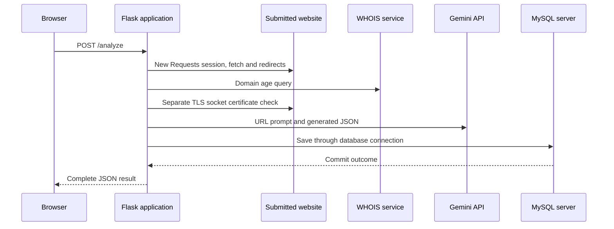
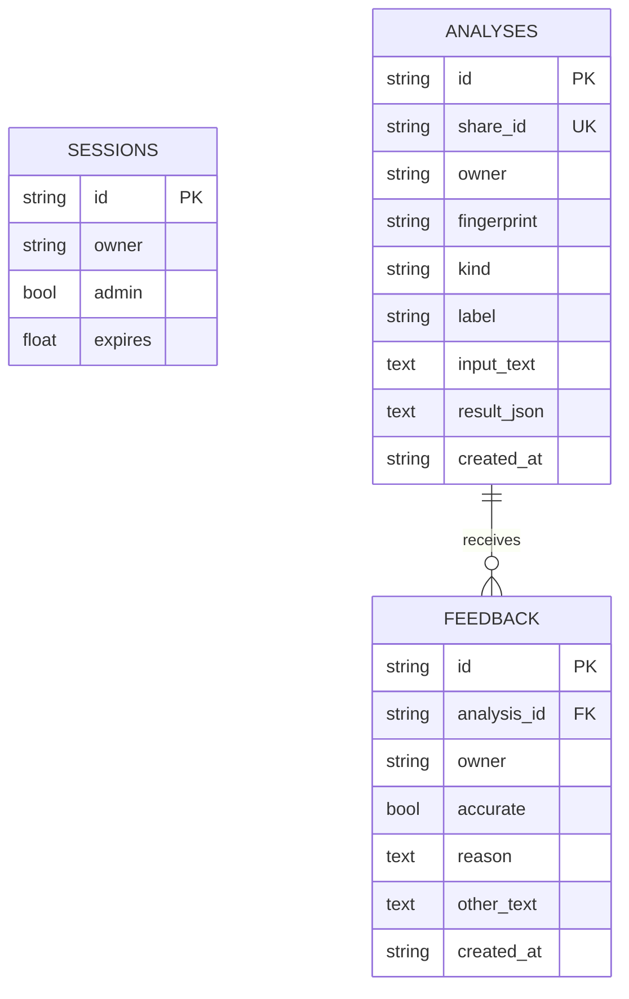

# Architecture and connection flow

This recreation targets **one local computer or one server, with one application process**. Efficiency comes from eliminating internal network boundaries, loading models once, bounding work and reusing resources. The original source reviewed was `05RANDOM-pmustudent/SESSION-1-25-26-FYP`, `main` at `b4f36cc70ede1eb5348ca3d77f3d29df01fbd67d`.

## Original flow observed in code

The original `web_scraper10.py` combines Flask routes, scraping, heuristic checks, Gemini calls, database access, authentication and feed aggregation in one module. Its browser already sends one analysis request, but the server performs several separate network operations inside it.



`analyze_website_local()` creates a Requests session for each URL check, then performs the website request, WHOIS lookup and a second TLS connection. The request uses `verify=False`; the independent certificate probe is not a substitute for verifying the fetched response. When Gemini succeeds, its score replaces the local score. Screenshot and news routes depend on Gemini vision/text. `get_db()` opens a MySQL connection for a request context and teardown closes it. Persistence helpers additionally manage their own connections. Feed refresh visits multiple RSS feeds and article pages to find images. CDN assets add browser dependencies.

The original protects administrator HTML pages with `login_required`, but several administrator JSON read/delete routes lack that decorator. The recreation protects every `/api/admin/*` route before it reads or changes data and adds CSRF checks to all mutations. These findings describe the reviewed source, not a test of a deployed original service.

## Rebuilt flow

```mermaid
sequenceDiagram
    participant Browser
    participant HTTP as Uvicorn + bounded ASGI adapter
    participant App as Validation and session checks
    participant Pipeline as Shared pipeline
    participant ML as Loaded local models
    participant DB as Embedded SQLite
    Browser->>HTTP: Initial HTTP connection and GET /api/bootstrap
    HTTP->>App: One bounded shared executor
    App->>DB: Existing local connection
    App-->>Browser: Token, capabilities, history and community
    Browser->>HTTP: POST /api/analyze on reusable connection
    HTTP->>App: Validate body, session, CSRF and limits
    App->>Pipeline: Submit canonical input
    alt Cached or already running
        Pipeline-->>App: Existing result or shared task
    else New input within capacity
        Pipeline->>ML: In-process feature extraction and inference
        ML-->>Pipeline: Score, evidence, identity and limits
    end
    App-->>Browser: Progress lines in same response
    App->>DB: Save successful result for this owner
    DB-->>App: Persisted ID and share token
    App-->>Browser: Final result line; end response, keep connection eligible for reuse
```

Screenshot jobs first invoke local Tesseract, then the SMS-spam model and up to five extracted URL classifications. Optional website inspection is the only URL-analysis stage that contacts a remote server. Default URL and news checks have zero outbound network calls. The manually requested headlines feed also uses outbound networking and an independent one-hour cache.

### Module ownership

| Module | Responsibility and lifetime |
| --- | --- |
| `__main__.py` | CLI, settings, one application/server and shutdown |
| `transport.py` | ASGI socket-facing bridge; 16 shared HTTP workers by default; streaming and disconnect signals |
| `app.py` | Routing, input limits, CSRF/origin/rate checks, event response and successful persistence |
| `pipeline.py` | Admission, shared pending tasks, model-versioned TTL cache, stages and result validation |
| `ml.py` | Deterministic hashed features, immutable JSON weights and local logistic inference |
| `network.py` | Public-address-only outbound fetching, DNS cache, pinned IPs and shared HTTP/S pools |
| `ocr.py` | Image validation and bounded local Tesseract subprocess |
| `storage.py` | Local SQLite schema, owner scope, feedback relationships and persistent thread connections |
| `auth.py` | Stable signing secret, revocable sessions, password hashes and CSRF tokens |
| `static/` | Dependency-free same-origin HTML, CSS and JavaScript |

### Scheduling, cache and completion

Analysis capacity is `workers + queue_size`: four executing jobs and eight waiting jobs by default. Excess distinct work receives a `503 busy` response before entering the analysis queue. A duplicate pending fingerprint can join its existing task even at capacity. The default HTTP adapter separately admits at most 16 request handlers; Uvicorn has a 64-concurrent-connection/task limit. Input bytes are bounded before business code runs.

Fingerprints include kind, canonical input, inspection option and the loaded model metadata signature. Cache entries expire after ten minutes and are capped at 256; stored results are copied so a caller cannot mutate another caller's cached data. Computation can be shared globally, but records and feedback remain scoped to each session owner. A repeated input from one owner updates that owner's existing row rather than duplicating it.

Tasks publish a small bounded event stream and signal completion through their future. The result is validated before cache insertion. The API only emits success after SQLite saves it. Inference or persistence failure produces an error event without a successful result. Once the HTTP stream begins, errors are encoded as terminal NDJSON events under HTTP 200; clients must inspect the event type, not only the status code.

Browser cancellation/disconnection stops the subscriber and closes its response iterator. It does not forcibly terminate a shared prediction that other callers may need. Bounded ongoing computation can finish and populate the cache; a disconnected request normally does not reach its save step. OCR has a 12-second limit, website fetching a ten-second total deadline and API analysis streams a 30-second deadline.

### Reuse and connection boundaries

- Models and static assets load once at startup. No model loader runs per request.
- SQLite connections persist per shared worker thread. There is no network database authentication or TLS handshake.
- DNS results are cached for 60 seconds with a bounded cache. Every answer must be public; one private answer rejects the target.
- Outbound pools are keyed by scheme, original host, approved IP and port, capped at 32 pools with two connections each. The socket connects to the approved IP while Host, HTTPS SNI and certificate verification retain the original hostname.
- Redirects are individually revalidated; HTTPS-to-HTTP downgrade is rejected. A 262 KB response cap, identity encoding, no automatic retry and a total socket-I/O deadline prevent unbounded fetching. No WHOIS call or extra certificate-only socket is used.
- The browser stream has an explicit end frame so HTTP/1.1 keep-alive works. The final benchmark verified one socket for 221 analysis-flow requests. Browser scheduling, server/proxy timeouts and remote peer decisions can still cause new connections.
- Tesseract starts locally for each uncached screenshot. This is process startup, not a network handshake. Replacing it with a persistent native binding would add another integration dependency; it should be driven by measured OCR workload.

The [performance report](PERFORMANCE.md) separates model microbenchmarks from full HTTP processing and records why the first server transport was replaced after it closed streamed connections.

## Storage and information flow



The three analysis modes share one table, one save contract and one administrator view. A unique `(owner, fingerprint)` constraint prevents duplicate ownership rows. Feedback references saved analyses and deletes with them. Indexes support recent history and kind/label summaries. Sessions carry the owner identity; analysis records are intentionally retained independently of session expiry.

SQLite uses WAL, foreign keys, a five-second busy timeout and `synchronous=NORMAL`. It is suitable for this single-machine design but remains a single-writer database. `NORMAL` can lose the most recent committed transactions after abrupt power loss while preserving database consistency. For stronger durability, change to `FULL` and measure the write cost. Back up with SQLite's backup API, or stop the server cleanly before copying the data directory; do not copy an active database file alone while ignoring its WAL.

Admin queries return aggregate counts and the latest 200 analyses/feedback, rather than unbounded history. Personal history defaults to 30 records. Long-term retention and admin pagination are future extensions; this edition does not automatically delete old analysis content. Shared results are bearer links; community rows redact URL paths/queries, identity and private text.

## Model decisions and migration boundaries

The rebuild preserves workflows rather than claiming parity with a generative vision or fact-checking system. Trained logistic classifiers produce stable local scores and feature associations. URL display labels use conservative thresholds. Scores from different models are not equally calibrated: combined screenshot/website results preserve the most severe component label independently of their numeric maximum and include component provenance. An explicit credential-request rule can promote a low-risk text label to review without modifying its ML probability.

News wording cannot prove truth or political bias, so every news result requires review. Screenshot OCR does not authenticate logos or identities. These limitations and held-out results are presented in the interface and [model card](MODEL_CARD.md). Training libraries and datasets are outside the serving dependency chain; models are JSON, never executable pickle files.

The original files remain available in the repository. The replacement lives in a separate `awarelink_ml/` directory for a reviewable migration. It has a new SQLite schema, session format, routes and result contract; no silent MySQL import or backward route compatibility is attempted. If old records must be retained, write a one-time, validated export/import mapping before switching users. Legacy scores should retain their original provider and version rather than appearing to be local ML results.

Scale decisions should follow measurement: first evaluate OCR and concurrent traffic on the intended machine, then tune admission and worker counts. Python threads provide bounded scheduling, but Python feature extraction still shares the interpreter lock. A CPU-heavy workload may eventually need native/vectorized inference or a dedicated process pool; multiple server processes would require coordinated cache, rate limits and storage decisions. No distributed broker or services are needed for the present one-server target.
